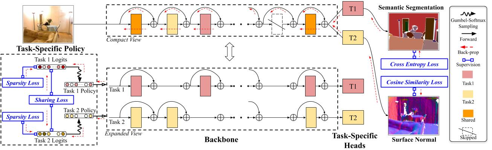

# AdaShare: Learning What To Share For Efficient Deep Multi-Task Learning (Neurips20)

## Introduction


AdaShare is a **novel** and **differentiable** approach for efficient multi-task
learning that learns the feature sharing pattern to achieve the best recognition accuracy, while
restricting the memory footprint as much as possible. Our main idea is to learn the sharing pattern
through a task-specific policy that selectively chooses which layers to execute for a given task in
the multi-task network. In other words, we aim to obtain a single network for multi-task learning
that supports separate execution paths for different tasks.

Here is [the link](https://arxiv.org/pdf/1911.12423.pdf) for our arxiv version. 

Welcome to cite our work if you find it is helpful to your research.
```
@article{sun2020adashare,
  title={Adashare: Learning what to share for efficient deep multi-task learning},
  author={Sun, Ximeng and Panda, Rameswar and Feris, Rogerio and Saenko, Kate},
  journal={Advances in Neural Information Processing Systems},
  volume={33},
  year={2020}
}
```

##  Experiment Environment

Our implementation is in Pytorch. We train and test our model on 1 `Tesla V100` GPU for `NYU v2 2-task`, `CityScapes 2-task` and use 2 `Tesla V100` GPUs for `NYU v2 3-task` and `Tiny-Taskonomy 5-task`. 

We use `python3.6` and  please refer to [this link](https://docs.conda.io/projects/conda/en/latest/user-guide/tasks/manage-environments.html#creating-an-environment-with-commands) to create a `python3.6` conda environment.

Install the listed packages in the virual environment:
```
conda install pytorch torchvision cudatoolkit=10.2 -c pytorch
conda install matplotlib
conda install -c menpo opencv
conda install pillow
conda install -c conda-forge tqdm
conda install -c anaconda pyyaml
conda install scikit-learn
conda install -c anaconda scipy
pip install tensorboardX
```

# Datasets
Please download the formatted datasets for `NYU v2` [here](https://drive.google.com/file/d/11pWuQXMFBNMIIB4VYMzi9RPE-nMOBU8g/view?usp=sharing) 

The formatted `CityScapes` can be found [here](https://drive.google.com/file/d/1WrVMA_UZpoj7voajf60yIVaS_Ggl0jrH/view?usp=sharing).

Download `Tiny-Taskonomy` as instructed by its [GitHub](https://github.com/StanfordVL/taskonomy/tree/master/data).

Remember to change the `dataroot` to your local dataset path in all `yaml` files in the `./yamls/`.

# Training
## Policy Learning Phase
Please execute `train.py` for policy learning, using the command 
```
python train.py --config <yaml_file_name> --gpus <gpu ids>
```
For example, `python train.py --config yamls/adashare/nyu_v2_2task.yml --gpus 0`.

Sample `yaml` files are under `yamls/adashare`

## Retrain Phase
After Policy Learning Phase, we sample 8 different architectures and execute `re-train.py` for retraining.
```
python re-train.py --config <yaml_file_name> --gpus <gpu ids> --exp_ids <random seed id>
```
where we use different `--exp_ids` to specify different random seeds and generate different architectures. The best performance of all 8 runs is reported in the paper.

For example, `python re-train.py --config yamls/adashare/nyu_v2_2task.yml --gpus 0 --exp_ids 0`. 

# Test/Inference
After Retraining Phase, execute `test.py` for get the quantitative results on the test set. 
```
python test.py --config <yaml_file_name> --gpus <gpu ids> --exp_ids <random seed id>
```
For example, `python test.py --config yamls/adashare/nyu_v2_2task.yml --gpus 0 --exp_ids 0`.

We provide our trained checkpoints as follows:
1. Please download  [our model in NYU v2 2-Task Learning](https://drive.google.com/file/d/1f49uFxHg9W5A3-s96f--QxQKrG1MABBw/view?usp=sharing)
2. Please donwload [our model in CityScapes 2-Task Learning](https://drive.google.com/file/d/1x0g8aOQ-esFXIGhoIKeegcl14zf45Ew_/view?usp=sharing)
3. Please download  [our model in NYU v2 3-Task Learning](https://drive.google.com/file/d/1ERfBiDf36rv0wJkb4BlE8w13IDuamcQ-/view?usp=sharing)

To use these provided checkpoints, please download them to `../experiments/checkpoints/` and uncompress there. Use the following command to test
```
python test.py --config yamls/adashare/nyu_v2_2task_test.yml --gpus 0 --exp_ids 0
python test.py --config yamls/adashare/cityscapes_2task_test.yml --gpus 0 --exp_ids 0
python test.py --config yamls/adashare/nyu_v2_3task_test.yml --gpus 0 --exp_ids 0
```

## Test with our pre-trained checkpoints
We also provide some sample images to easily test our model for nyu v2 3 tasks.

Please download  [our model in NYU v2 3-Task Learning](https://drive.google.com/file/d/1ERfBiDf36rv0wJkb4BlE8w13IDuamcQ-/view?usp=sharing)

Execute `test_sample.py` to test on sample images in `./nyu_v2_samples`, using the command 
```
python test_sample.py --config  yamls/adashare/nyu_v2_3task_test.yml --gpus 0
```
It will print the average quantitative results of sample images.

## Note
If any link is invalid or any question, please email sunxm@bu.edu


